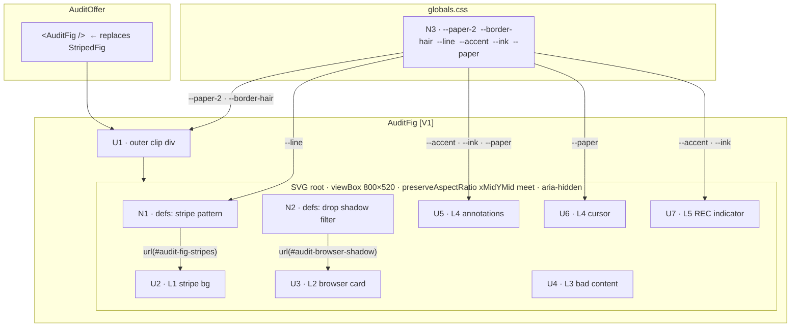

# AuditFig — Slices

**Shape:** A — Inline SVG Illustration  
**Shaping doc:** `docs/feature-specs/audit-fig-shaping.md`  
**Source spec:** `docs/feature-specs/audit-fig.md`

---

## Slice map

| Slice | What ships | Demo |
|-------|-----------|------|
| **V1** | `AuditFig` function + JSX swap in `AuditOffer` | Scroll to AuditOffer — browser mockup visible instead of stripes |

One slice. The function and the swap are coupled: adding the function without the swap produces no visible output; the swap without the function is a compile error. They ship together.

---

## V1 — AuditFig complete

### Affordances in scope

**UI**

| ID | Affordance | Place |
|----|-----------|-------|
| U1 | Outer clip container — `background: var(--paper-2)`, `border: var(--border-hair)`, 520px, `borderRadius: 28`, `overflow: hidden` | `AuditFig` |
| U2 | Layer 1: stripe background — `<rect fill="url(#audit-fig-stripes)"/>` | `AuditFig` |
| U3 | Layer 2: browser chrome card — white rect, plain grey header bar only (no traffic lights, no URL bar), `feDropShadow` filter | `AuditFig` |
| U4 | Layer 3: bad website content — nav, headline, subtext, CTA, broken image X, footer | `AuditFig` |
| U5 | Layer 4: audit annotation overlays — two dashed highlight rects + callout bubbles + arrow polygons | `AuditFig` |
| U6 | Layer 4: cursor glyph — path near CTA annotation | `AuditFig` |
| U7 | Layer 5: REC indicator — circle + REC text above browser card | `AuditFig` |

**Non-UI**

| ID | Affordance | Place |
|----|-----------|-------|
| N1 | `<defs>` stripe pattern — `id="audit-fig-stripes"`, `style={{stroke: 'var(--line)'}}` | `AuditFig` |
| N2 | `<defs>` drop shadow filter — `id="audit-browser-shadow"`, `feDropShadow floodColor="rgba(1,11,9,0.10)"` | `AuditFig` |

### Code changes

| File | Location | Change |
|------|----------|--------|
| `components/PortfolioClient.tsx` | After `StripedFig` closing brace (~line 54) | Add `AuditFig` function |
| `components/PortfolioClient.tsx` | Inside `AuditOffer` (~line 183) | Replace `<StripedFig h={520} label="loom audit · 16:9" id="audit-fig"/>` with `<AuditFig />` |

### Token usage

| CSS var | Applied to | Via |
|---------|-----------|-----|
| `var(--paper-2)` | outer div `background` | React `style` prop |
| `var(--border-hair)` | outer div `border` | React `style` prop |
| `var(--line)` | N1 stripe `stroke` | SVG `style` prop |
| `var(--accent)` | U5 annotation strokes, U7 REC circle | SVG `style` prop |
| `var(--ink)` | U5 callout bubbles + polygons, U7 REC text | SVG `style` prop |
| `var(--paper)` | U5 callout text, U6 cursor fill | SVG `style` prop |

**Justified hardcoded values:**

| Value | Element | Reason |
|-------|---------|--------|
| `rgba(1,11,9,0.10)` | N2 `feDropShadow floodColor` | CSS vars unreliable in SVG filter primitives cross-browser |
| `rgba(255,94,0,0.08/0.10)` | U5 annotation rect `fill` | Semi-transparent derived value; no token exists for alpha variants |
| `#DDD`, `#F2F2F2`, `#C8C8C8`, etc. | U3, U4 mockup content | Illustration-internal grays; not Kicksnare design tokens |
| `#333` | U6 cursor outline `stroke` | No cursor-outline token |

### Verification checklist

1. `pnpm dev` — no runtime errors, no TypeScript errors
2. Scroll to AuditOffer — browser mockup visible in place of stripes
3. Orange dashed annotation boxes on headline and CTA areas
4. REC indicator (orange dot + `REC` text) in top-right corner of striped margin
5. Resize viewport — `preserveAspectRatio="xMidYMid meet"` maintains proportions; no clipping
6. Inspect SVG — `aria-hidden="true"` present on SVG root
7. Inspect computed styles — branded colors resolve to token values (not hardcoded hex)

---

## Sliced breadboard

