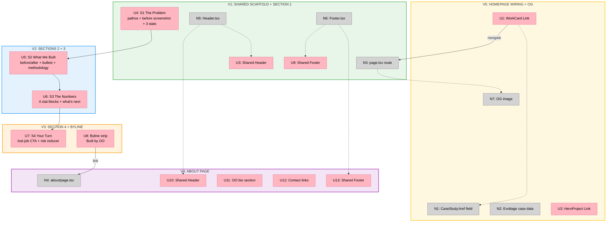

# Evoltage Case Study — Slices

## Sliced Breadboard

**Legend:**

- **Pink nodes (U)** = UI affordances (things users see/interact with)
- **Grey nodes (N)** = Code affordances (data stores, handlers, services)
- **Solid lines** = Wires Out (calls, triggers, navigations)
- **Dashed lines** = Returns To (reads data from)

---

## Slices Grid

|  |  |  |
|:--|:--|:--|
| **V1: SHARED SCAFFOLD + SECTION 1** ✅ IMPLEMENTED  • Extract Header.tsx from PortfolioClient • Extract Footer.tsx from PortfolioClient • Create app/case-studies/evoltage/page.tsx • S1: pathos headline, JJ intro, before screenshot (real desktop screenshot in browser mockup with annotations), 3 stats  *Demo: Navigate to /case-studies/evoltage, see S1 with header/footer* | **V2: SECTIONS 2 + 3** ✅ IMPLEMENTED  • S2: before/after real mobile screenshots (evoltage-before-mobile.png / evoltage-after-mobile.png) • S2: plain-English bullet list + methodology sentence • S3: 4 large stat blocks (5-second test delta) • S3: "what's next" text block  *Demo: Scroll S1 through S3, full evidence arc* | **V3: SECTION 4 + BYLINE** ✅ IMPLEMENTED  • S4: lost-job framing copy • S4: spec-work honesty line • S4: CTA buttons (booking + contact + DM) • Byline strip "Built by OO" with /about link  *Demo: Complete case study page end-to-end* |
| **V4: ABOUT PAGE** ✅ IMPLEMENTED  • Create app/about/page.tsx • OO bio: name, background, positioning • Photo placeholder • Contact links (DM + email + booking)  *Demo: Click "Built by OO" on case study, see bio page* | **V5: HOMEPAGE WIRING + OG META** ✅ IMPLEMENTED  • Add href? to CaseStudy interface • Evoltage entry in cases[] array • WorkCard conditional Link vs button • HeroProject row conditional • OG metadata + social image  *Demo: Click evoltage card on homepage, navigates to case study* | |

---

## V1: Shared Scaffold + Section 1

### Affordances

| ID | Type | Affordance |
|----|------|-----------|
| N5 | Non-UI | `components/Header.tsx` — extract from PortfolioClient lines 189-378. Props: `fonts`, `scrolled`, `heroPassed`, `isMobile`, `activeSection`. Homepage imports from new location. |
| N6 | Non-UI | `components/Footer.tsx` — extract from PortfolioClient lines 1301-1318. Props: `fonts`. |
| N3 | Non-UI | `app/case-studies/evoltage/page.tsx` — Server Component shell with metadata export. |
| U3 | UI | Shared Header on case study page |
| U4 | UI | S1: The Problem — `(01) The problem` eyebrow, pathos headline, JJ paragraph, annotated before SVG, 3 inline stats |
| U9 | UI | Shared Footer on case study page |

### Key files

- `components/PortfolioClient.tsx` — extract Header (lines 189-378) and Footer (lines 1301-1318) into separate files, replace inline definitions with imports
- `components/Header.tsx` — new file
- `components/Footer.tsx` — new file
- `app/case-studies/evoltage/page.tsx` — new file

---

## V2: Sections 2 + 3

### Affordances

| ID | Type | Affordance |
|----|------|-----------|
| U5 | UI | S2: What We Built — `(02) What we built` eyebrow, before/after screenshot pair, bullet list with check icons, methodology sentence |
| U6 | UI | S3: The Numbers — `(03) The numbers` eyebrow, 4 large stat blocks (value + label + sub), "what's next" text block |

### Key files

- `app/case-studies/evoltage/page.tsx` — add S2 and S3 sections below S1

---

## V3: Section 4 + Byline

### Affordances

| ID | Type | Affordance |
|----|------|-----------|
| U7 | UI | S4: Your Turn — `(04) Your turn` eyebrow, lost-job copy, spec-work line, CTA group (booking + contact + DM), guarantee |
| U8 | UI | Byline strip — "Built by OO" + link to `/about` (dead link until V4) |

### Key files

- `app/case-studies/evoltage/page.tsx` — add S4 and byline

---

## V4: About Page

### Affordances

| ID | Type | Affordance |
|----|------|-----------|
| N4 | Non-UI | `app/about/page.tsx` — Server Component with metadata |
| U10 | UI | Shared Header |
| U11 | UI | OO bio section — name, "seven years in retail PM", Kicksnare origin, anti-agency copy, photo placeholder |
| U12 | UI | Contact links — DM + email + booking, same visual pattern as case study CTA |
| U13 | UI | Shared Footer |

### Key files

- `app/about/page.tsx` — new file

---

## V5: Homepage Wiring + OG Meta

### Affordances

| ID | Type | Affordance |
|----|------|-----------|
| N1 | Non-UI | Add `href?: string` to `CaseStudy` interface in `lib/cases.ts` |
| N2 | Non-UI | Add evoltage entry to `cases[]` and `heroProjects[]` in `lib/cases.ts` |
| U1 | UI | `WorkCard` — conditional: render `<Link href={c.href}>` when href exists, `<button onClick={onOpen}>` otherwise |
| U2 | UI | `HeroProject` row — same conditional for hero project list |
| N7 | Non-UI | OG image — `app/case-studies/evoltage/opengraph-image.tsx` or static asset |

### Key files

- `lib/cases.ts` — add `href?` field, add evoltage entry
- `components/PortfolioClient.tsx` — update WorkCard and hero project row with conditional rendering
- `app/case-studies/evoltage/opengraph-image.tsx` — new file (or static `public/og/evoltage.png`)
