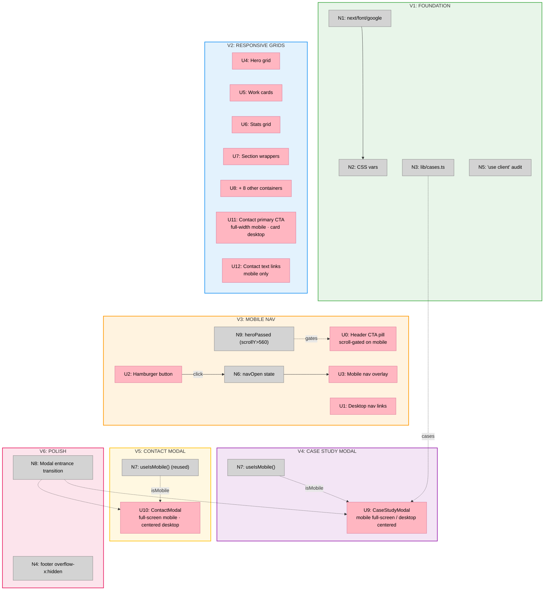

# Kicksnare — Mobile-First Responsive Layout — Big Picture

**Selected shape:** C — Tailwind arbitrary values + useIsMobile() for modals

---

## Frame

### Problem

- Site is 100% desktop-first: hardcoded multi-column inline styles, no responsive breakpoints
- At 375px, 3–4 column grids shrink to unreadable widths
- Navigation is a horizontal flex row with no mobile menu — all links are inaccessible on mobile
- Section padding hardcoded at 56px; `--wrap-pad-mobile: 24px` declared but never used
- Modals have no mobile treatment + hidden-start animations that freeze at `opacity:0` — they appear broken or invisible
- Oversized footer wordmark bleeds past viewport, causing horizontal scroll on mobile
- Design prototype files not ported; case data inline; fonts via CDN; missing `'use client'`

### Strategic Why

Every mobile layout failure is a **processing fluency failure** — and fluency failures are trust failures.

The psychological research is unambiguous: the brain misattributes ease of interaction as a signal of quality and competence. A mobile user encountering horizontal scroll, unreadable columns, or a modal that opens invisible does not consciously think "this site has a CSS bug." They feel — automatically, System 1, in milliseconds — that the product is unpolished and untrustworthy. The brand absorbs the penalty.

The specific failures map to specific psychological costs:

| Failure | Psychological Mechanism | Cost |
|---|---|---|
| Horizontal scroll, unreadable columns | Processing fluency break | Brand competence signal damaged |
| Frozen modals (opacity:0) | Loss frame — "this is broken" | Abandonment, no return |
| No hamburger menu | Hick's Law — hidden choices still tax working memory | Cognitive load on every page view |
| Hardcoded 56px padding on 375px screen | Cognitive load overload | Content feels dense, unread |
| Google Fonts CDN dependency | Load time risk → loss aversion window | 53% of users abandon at >3s |

Mobile users are operating in **System 1** — distracted, time-pressured, often in motion. System 2 deliberate evaluation is not available. Designs that require it to compensate for broken layouts will lose users before they have a chance to evaluate the offer.

The mobile-first constraint is not a limitation — it is a cognitive forcing function. Scarcity of screen space forces prioritisation. The question "what is the single most important thing a user needs here?" becomes mandatory rather than optional. The result is almost always a better desktop experience too.

**The bottom sheet ContactModal** is not just a mobile affordance — it is a **zero-effort zone** decision. The thumb rests naturally at the bottom of the screen. Placing the primary action there removes motor cognition from the interaction entirely. The user's mental resources stay on the content, not on the physical act of reaching.

**The hamburger nav** is Hick's Law applied correctly: navigation options that are visible claim working memory budget even when the user is not using them. Collapsing to a hamburger removes that tax from every page view while keeping everything one tap away.

### Outcome

- Real full-width fluid experience from 375px → 1440px; no horizontal scroll at any viewport
- Desktop design unchanged and pixel-identical at ≥1024px
- Modals open visibly and correctly at first render — no frozen or invisible states
- Navigation reachable on mobile via hamburger — all 4 links + CTA accessible
- Self-hosted fonts (no CDN dependency), typed case data, clean component structure
- Processing fluency restored: layout feels intentional, trustworthy, and polished at every breakpoint

---

## Shape

### Fit Check (R × C)

| Req | Requirement | Status | C |
|-----|-------------|--------|---|
| R0 | Real full-width fluid site from 375px up — no artificial container or phone frame | Core goal | ✅ |
| R1 | Every multi-column grid must stack to 1 column as the mobile default | Must-have | ✅ |
| R2 | Header nav collapses on mobile — all 4 links + CTA reachable via hamburger | Must-have | ✅ |
| R3 | Headlines scale with `clamp()` — existing values preserved, not replaced | Must-have | ✅ |
| R4 | Section horizontal padding: 24px mobile (`--wrap-pad-mobile`), 56px desktop | Must-have | ✅ |
| R5 | Desktop design (≥1024px) must remain pixel-identical to current | Must-have | ✅ |
| R6 | No SSR hydration mismatch for above-the-fold / page-level layouts | Must-have | ✅ |
| R7 | No new npm dependencies | Must-have | ✅ |
| R8 | CaseStudyModal: full-screen on mobile, centered dialog on desktop | Must-have | ✅ |
| R9 | 🟡 ContactModal: full-screen task view on mobile (`fixed inset-0`, solid background, 44px close target, safe-area inset padding) — no partial overlay; centered card on desktop unchanged | Must-have | ✅ |
| R10 | Modals adapt via `useIsMobile()` hook — one component each, no duplication | Must-have | ✅ |
| R11 | Soundwave logo SVG + beat animation preserved exactly | Must-have | ✅ |
| R12 | Full CSS token palette preserved as-is | Must-have | ✅ |
| R13 | Contact form submits to info@kicksnare.digital | Must-have | ✅ |
| R14 | "Book a slot" CTA card preserved in contact section | Must-have | ✅ |
| R15 | Tweaks panel (`tweaks-panel.jsx`) is prototype-only — do NOT port to `components/` | Must-have | ✅ |
| R16 | Port `portfolio-app.jsx` and `portfolio-desktop-app.jsx` → `components/*.tsx` | Must-have | ✅ |
| R17 | Case study data → `lib/cases.ts`, typed, imported | Must-have | ✅ |
| R18 | Fonts: swap Google `<link>` for `next/font/google`; wire to `--display / --serif / --mono` | Must-have | ✅ |
| R19 | All components using `useState`/`useEffect` must have `'use client'` as first line | Must-have | ✅ |
| R20 | Modals must open visible — remove hidden-start opacity:0 animations; modal base state `opacity:1` | Must-have | ✅ |
| R21 | No horizontal scroll on mobile — clip the oversized footer wordmark bleed with `overflow-x: hidden` on the footer element (NOT on `html`/`body`, which would break the sticky header); verify `scrollWidth === clientWidth` | Must-have | ✅ |
| R22 | Section vertical padding scales down on mobile | Nice-to-have | ✅ |
| R23 | 🟡 On mobile, Contact section: single primary full-width "Contact us" button; "DM @kicksnare ↗" and "Book a slot ↗" demoted to quiet text links below it; desktop three-card layout unchanged (R14 preserved on desktop) | Must-have | ✅ |
| R24 | 🟡 On mobile, header CTA pill hidden (`opacity-0 pointer-events-none`) while hero in viewport (scrollY ≤ 560px); transitions visible after hero passes; desktop header CTA unchanged | Must-have | ✅ |
| R25 | 🟡 Hero left column (default layout): on mobile, headline + CTA (P1) travel together above the fold; description (P3) yields to below the CTA; desktop column order unchanged | Must-have | ✅ |
| R26 | 🟡 Problem pain cards and Process steps — on mobile, descriptions collapsed behind a tap (accordion); titles always visible; rotating +/× indicator; `grid-template-rows: 0fr → 1fr` smooth expand; Process step 1 open by default; desktop: both sections fully open and unchanged | Must-have | ✅ |

### Parts

| Part | Mechanism | Flag |
|------|-----------|:----:|
| **C1** | Tailwind responsive grid classes on all 13 containers (see Detail C table in shaping doc) | |
| **C2** | Section wrappers: `px-[var(--wrap-pad-mobile)] lg:px-[var(--wrap-pad-desktop)] py-[80px] lg:py-[120px)]` | |
| **C3** | Desktop nav: `hidden md:flex gap-9`; hamburger: `flex md:hidden`; mobile overlay: fixed full-screen, `navOpen` state | |
| **C4** | Remove all hardcoded `style={{gridTemplateColumns: ...}}` inline styles; wire Tailwind classes in | |
| **C5** | `hooks/useIsMobile.ts` — `window.innerWidth < 1024`, resize listener, SSR-safe (returns `false` on server) | |
| **C6** | `CaseStudyModal` — `fixed inset-0 overflow-y-auto` on mobile; `max-w-4xl mx-auto` centered on desktop; single component | |
| **C7** | 🟡 `ContactModal` — `fixed inset-0` full-screen task view on mobile (solid `var(--primary)` background, 44×44px close button, `env(safe-area-inset-bottom)` padding); `max-w-lg mx-auto` centered card on desktop | |
| **C8** | Port `portfolio-app.jsx` → `components/portfolio-app.tsx`; `portfolio-desktop-app.jsx` → `components/portfolio-desktop-app.tsx` | |
| **C9** | `lib/cases.ts` — `CaseStudy` interface, typed array, imported into components | |
| **C10** | `app/layout.tsx` — `next/font/google`: Space Grotesk (`--font-display`), Crimson Pro (`--font-serif`), JetBrains Mono (`--font-mono`); remove CDN `<link>` | |
| **C11** | `footer { overflow-x: hidden }` in `globals.css` — scoped to `footer` element, NOT `html`/`body` (would break sticky header) | |
| **C12** | `'use client'` as first line on every component using `useState` / `useEffect` | |
| **C13** | Remove `r-fade`, `r-rise`, `r-sheet` keyframes; replace with CSS `transition: transform 350ms` on modal open/close | |
| **C14** | 🟡 Contact section mobile CTA: `useIsMobile()` (C5) gates layout — mobile = full-width primary "Contact us" `<button>` + `"or DM @kicksnare ↗ · Book a slot ↗"` text links row; desktop = existing three-card layout unchanged | |
| **C15** | 🟡 Header scroll gate: `heroPassed` state (`scrollY > 560`) added to PortfolioClient; Header receives `heroPassed` + `isMobile`; CTA pill `opacity-0 pointer-events-none` when `isMobile && !heroPassed`, else `opacity-100 transition-opacity duration-400`; desktop always visible | |
| **C16** | 🟡 Hero P1/P3 mobile reorder (default layout only): description `<Reveal>` wrapper → `order-3 lg:order-2`; CTA `<Reveal>` wrapper → `order-2 lg:order-3`; headline wrapper unchanged; desktop order identical to current | |
| **C17** | 🟡 `PainItem` accordion + Process step accordion: `useState(open)` per item; pain cards default `false`; process step 1 default `true`; mobile: `grid-template-rows: 0fr → 1fr` expand; rotating +/× indicator; `useIsMobile()` (C5) renders always-open static version on desktop | |

### Breadboard

```mermaid
flowchart TB
    subgraph foundation["PLACE: App Foundation"]
        N1["N1: next/font/google\n(Space Grotesk · Crimson Pro · JetBrains Mono)"]
        N2["N2: CSS vars\n--display / --serif / --mono"]
        N3["N3: lib/cases.ts\nCaseStudy[] typed + exported"]
        N4["N4: footer overflow-x:hidden\n(scoped — not html/body)"]
        N5["N5: 'use client' audit\nall hook-using components"]
    end

    subgraph nav["PLACE: Header / Nav"]
        U0["U0: Header CTA pill\n'Free audit' · mobile: opacity-0→100 gated by N9\ndesktop: always visible"]
        U1["U1: Desktop nav links\nhidden md:flex gap-9"]
        U2["U2: Hamburger button\nflex md:hidden"]
        U3["U3: Mobile nav overlay\nfixed full-screen · primary bg · z-[99]"]
        N6["N6: navOpen\nuseState boolean"]
        N9["N9: heroPassed\nscrollY > 560 · mobile gate for U0 (C15)"]
    end

    subgraph sections["PLACE: Page Sections (13 containers)"]
        U4["U4: Hero\ngrid-cols-1 lg:grid-cols-[1.4fr_1fr]"]
        U5["U5: Work cards\ngrid-cols-1 sm:grid-cols-2 lg:grid-cols-3"]
        U6["U6: Stats\ngrid-cols-2 lg:grid-cols-4"]
        U7["U7: Section wrappers\npx-[--wrap-pad-mobile] lg:px-[--wrap-pad-desktop]"]
        U8["U8: + 8 other grid containers\n(audit · problem · pain · about · process ×2)"]
    end

    subgraph contactPlace["PLACE: Contact Section (C14)"]
        U11["U11: Primary CTA button\n'Contact us' · full-width · mobile\npart of three-card layout · desktop unchanged"]
        U12["U12: Text links row\n'or DM @kicksnare ↗ · Book a slot ↗'\nmobile only · hidden on desktop"]
    end

    subgraph hookPlace["PLACE: hooks/"]
        N7["N7: useIsMobile()\nwindow.innerWidth < 1024\nresize listener · SSR-safe"]
    end

    subgraph modals["PLACE: Modals"]
        U9["U9: CaseStudyModal\nmobile: fixed inset-0\ndesktop: max-w-4xl centered"]
        U10["U10: ContactModal\nmobile: fixed inset-0 · full-screen · 44px close\ndesktop: max-w-lg centered card"]
        N8["N8: Modal entrance\ntransition:transform 350ms\nbase state opacity:1"]
    end

    N1 --> N2
    N2 -.->|font vars| U4
    N2 -.->|font vars| U9
    N3 -.->|cases data| U9
    N7 -.->|isMobile| U9
    N7 -.->|isMobile| U10
    N7 -.->|isMobile| U0
    N7 -.->|isMobile| U11
    N7 -.->|isMobile| U12
    N9 -.->|heroPassed| U0
    U2 -->|click| N6
    N6 -->|open/close| U3
    U3 -.->|closes on link tap| U1
    N8 -.->|transition| U9
    N8 -.->|transition| U10

    classDef ui fill:#ffb6c1,stroke:#d87093,color:#000
    classDef nonui fill:#d3d3d3,stroke:#808080,color:#000
    class U0,U1,U2,U3,U4,U5,U6,U7,U8,U9,U10,U11,U12 ui
    class N1,N2,N3,N4,N5,N6,N7,N8,N9 nonui
```

**Legend:**
- **Pink nodes (U)** = UI affordances (things users see/interact with)
- **Grey nodes (N)** = Code affordances (data, hooks, handlers)
- **Solid lines** = Wires Out (calls, triggers, writes)
- **Dashed lines** = Returns To / reads

---

## Slices

|  |  |  |
|:--|:--|:--|
| **[V1: FOUNDATION](./spicy-forging-storm-v1-plan.md)** ⏳ PENDING  • Port prototypes → `components/*.tsx` • `lib/cases.ts` typed `CaseStudy[]` • `next/font/google` in `layout.tsx` • `'use client'` audit all hooks  *Demo: App loads, self-hosted fonts in Network tab, no console errors* | **[V2: RESPONSIVE GRIDS](./spicy-forging-storm-v2-plan.md)** ⏳ PENDING  • Tailwind responsive classes on all 13 containers • 🟡 Hero P1/P3 reorder — CTA above description on mobile (C16) • 🟡 Contact section mobile CTA hierarchy (C14) • 🟡 Pain cards + Process steps accordion on mobile (C17)  *Demo: At 375px — hero CTA above fold; accordions scannable; Contact single CTA* | **[V3: MOBILE NAV](./spicy-forging-storm-v3-plan.md)** ⏳ PENDING  • Hamburger visible on mobile, hidden md+ • `navOpen` state toggles overlay • All 4 links + CTA in mobile nav • 🟡 Header CTA pill scroll-gated on mobile (C15)  *Demo: Tap hamburger at 375px → full-screen nav; scroll past hero → header CTA fades in* |
| **[V4: CASE STUDY MODAL](./spicy-forging-storm-v4-plan.md)** ⏳ PENDING  • `hooks/useIsMobile.ts` • CaseStudyModal full-screen at mobile • CaseStudyModal centered dialog at desktop • Single component, no duplication  *Demo: Tap work card at 375px → full-screen modal; at 1024px → centered dialog* | **[V5: CONTACT MODAL](./spicy-forging-storm-v5-plan.md)** ⏳ PENDING  • 🟡 ContactModal full-screen on mobile (`fixed inset-0`, 44px close) • ContactModal centered card on desktop unchanged • Form → `info@kicksnare.digital` preserved • `env(safe-area-inset-bottom)` padding  *Demo: Tap contact at 375px → full-screen task view (no partial overlay)* | **[V6: POLISH](./spicy-forging-storm-v6-plan.md)** ⏳ PENDING  • `footer { overflow-x: hidden }` (not html/body) • Remove hidden-start opacity:0 modal animations • Section vertical padding scales on mobile • Soundwave logo + animation verified  *Demo: No horizontal scroll at 375px; modals open at opacity:1* |
